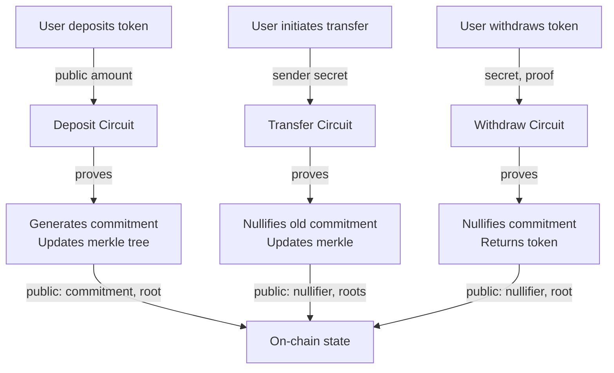
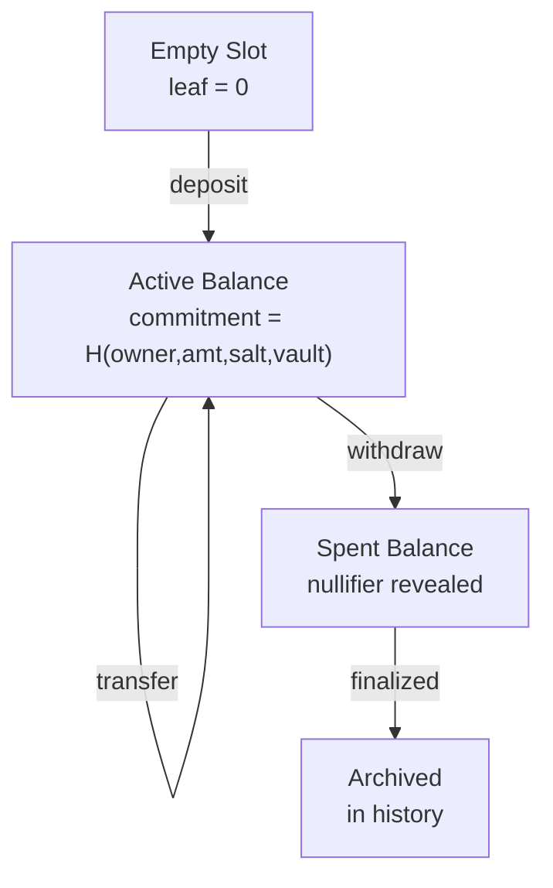

# ZK Noir Circuits Architecture

## System Overview

ZK proof system for shielded pool + vaults using Noir circuits with PER TEE proving environment. Provides Railgun-style private payments with efficient batch settlement on Solana.

**Core Guarantees:**

- **Balance Conservation**: No token creation/destruction in transfers
- **Ownership**: Only secret key holder can spend their balance
- **No Double-Spend**: Nullifiers prevent spending same commitment twice
- **Merkle Membership**: All active balances exist in commitment tree
- **Valid State Transitions**: Provable root updates through Merkle operations

## Architecture Overview

### Component Layers

```
┌─────────────────────────────────────────────────────────────┐
│ Layer 3: Settlement                                         │
│ ├─ Batch Proof Aggregation (recursive verification)        │
│ └─ Solana Verifier (alt_bn128 pairing checks)              │
├─────────────────────────────────────────────────────────────┤
│ Layer 2: Transaction Circuits                              │
│ ├─ Deposit  (shield: public → private)                     │
│ ├─ Transfer (private → private)                            │
│ └─ Withdraw (unshield: private → public)                   │
├─────────────────────────────────────────────────────────────┤
│ Layer 1: Primitives                                         │
│ ├─ Merkle Tree Operations (sparse 24-level tree)           │
│ ├─ Nullifier Computation (double-spend prevention)         │
│ ├─ Balance Commitment (binding hash)                       │
│ └─ Vault Extension (membership + intra-vault ops)          │
├─────────────────────────────────────────────────────────────┤
│ Proving Environment: PER TEE                               │
│ ├─ Fast witness generation                                │
│ ├─ Batch aggregation logic                                │
│ └─ Input privacy (secrets never leave TEE)                │
└─────────────────────────────────────────────────────────────┘
```

### Data Flow Diagram



### State Transitions



## Data Structures

### Balance Commitment

The commitment is a binding hash of the balance information. It commits to ownership, amount, blinding factor, and vault context.

```noir
struct Balance {
    owner: Field,      // Hash(public_key) - proves authorization
    amount: Field,     // Token quantity
    salt: Field,       // Random blinding factor
    vault_id: Field,   // 0 for solo, vault hash for members
}

fn compute_commitment(balance: Balance) -> Field {
    // Poseidon2 hash with domain separation
    Poseidon2::hash([COMMITMENT_DOMAIN, balance.owner,
                     balance.amount, balance.salt, balance.vault_id], 5)
}
```

The commitment is deterministic: same balance inputs always produce the same commitment. This enables Merkle tree construction and zero-knowledge proofs.

### Nullifier

Prevents double-spending by hashing commitment with secret key and nonce. Reveals one unique value per spendable commitment.

```noir
fn compute_nullifier(commitment: Field, secret_key: Field, nonce: Field) -> Field {
    Poseidon2::hash([NULLIFIER_DOMAIN, commitment, secret_key, nonce], 4)
}
```

**Key Property**: Only the secret key holder can compute the correct nullifier for a commitment. The commitment itself is public (in tree), but the nullifier is deterministic from the secret.

### Merkle Tree

Sparse Merkle Tree structure for efficient membership proofs.

```noir
struct MerkleProof<let N: u32> {
    siblings: [Field; N],      // Sibling hashes along path
    path_indices: [u1; N],     // 0=left, 1=right at each level
}

fn verify_inclusion<let N: u32>(
    leaf: Field,
    root: Field,
    proof: MerkleProof<N>
) -> bool {
    let mut current = leaf;
    for i in 0..N {
        let is_right = proof.path_indices[i];
        // Arithmetic selection: more constraint-efficient
        let left_hash = hash_pair(current, proof.siblings[i]);
        let right_hash = hash_pair(proof.siblings[i], current);
        current = left_hash + is_right * (right_hash - left_hash);
    }
    current == root
}
```

**Specs:**

- **Depth**: 24 levels → 2^24 = 16M capacity
- **Hash**: Poseidon2 (2-to-1 compression)
- **Type**: Sparse (supports efficient insertions and updates)

## Circuit Hierarchy

### Layer 1: Primitives

**commitment.nr** - Balance commitment computation

- Hashes balance information deterministically
- Binds amount, owner, salt, vault context
- Used in all transaction circuits

**nullifier.nr** - Nullifier computation

- Derives unique public value from commitment + secret + nonce
- Prevents double-spending when revealed on-chain
- Only holder of secret key can compute

**merkle.nr** - Merkle tree operations

- Inclusion proofs (balance exists in tree)
- Update proofs (tree modifications are valid)
- Efficient constraint-bounded verification

### Layer 2: Transactions

**deposit.nr** - Shield (public → private)

- **Public inputs**: deposit_amount, new_commitment, old_root, new_root
- **Private inputs**: owner, salt, vault_id, merkle_insertion_proof
- **Proves**: Creating valid new balance and extending tree
- **Constraint cost**: Low (~5K) - single Merkle path

**transfer.nr** - Private transaction

- **Public inputs**: nullifier, old_root, new_root
- **Private inputs**: sender commitment + secret, receiver pubkey, transfer_amount, Merkle proofs
- **Proves**: Valid state transition with balance conservation
- **Constraint cost**: Medium (~15K) - two Merkle paths + nullifier

**withdraw.nr** - Unshield (private → public)

- **Public inputs**: nullifier, withdraw_amount, recipient_address, old_root, new_root
- **Private inputs**: owner_secret, balance, merkle_proof, nonce
- **Proves**: Valid withdrawal with commitment nullification
- **Constraint cost**: Medium (~10K) - one path + nullifier

### Layer 3: Aggregation

**batch_N.nr** (N ∈ {2,4,8,16,32,64}) - Batch proof aggregation

- **Public inputs**: initial_root, final_root, nullifier_list
- **Private inputs**: Individual proofs + verification keys
- **Proves**: Correctness of proof chain and root transitions
- **Constraint cost**: Medium (~200K per batch_2) - recursive verification

Recursive verification allows chaining proofs: batch_64 can aggregate 64 transactions into one proof for settlement.

### Vault Extension

**vault/membership.nr** - Vault membership proof

- Proves user is authorized member of vault
- Enables vault-specific operations
- Used as prerequisite for vault transfers

**vault/transfer.nr** - Intra-vault transfer

- Combines transfer + membership verification
- Optimized for vault-specific constraints
- Shorter proofs than general transfer

## Implementation Patterns

### Pattern 1: Bitwise Boolean Constraints

For constraining fields to 0 or 1:

```noir
// ✅ Use bitwise OR (constrains properly)
assert((is_right == 0) | (is_right == 1));

// ❌ Avoid logical OR (may not fully constrain)
assert((is_right == 0) || (is_right == 1));
```

### Pattern 2: Arithmetic Selection (Branch Avoidance)

Computing different values based on a boolean flag efficiently:

```noir
// ✅ More constraint-efficient
let left_hash = hash_pair(current, sibling);
let right_hash = hash_pair(sibling, current);
current = left_hash + is_right * (right_hash - left_hash);

// ❌ Less efficient (requires conditional logic)
current = if is_right == 1 {
    hash_pair(sibling, current)
} else {
    hash_pair(current, sibling)
};
```

### Pattern 3: Range Checks for Type Conversions

Prevent overflow by validating round-trip conversions:

```noir
// ✅ Prevent overflow attacks
let amount_u64 = amount as u64;
let amount_back = amount_u64 as Field;
assert(amount == amount_back);  // Ensures amount fits in u64
```

### Pattern 4: Domain Separation

Use different domain constants to prevent hash collisions between different operations:

```noir
global COMMITMENT_DOMAIN: Field = 0x01;
global NULLIFIER_DOMAIN: Field = 0x02;
global MERKLE_DOMAIN: Field = 0x03;

// Each operation type has unique domain
let commitment = Poseidon2::hash([COMMITMENT_DOMAIN, owner, amount, ...], 5);
let nullifier = Poseidon2::hash([NULLIFIER_DOMAIN, commitment, secret, ...], 4);
```

## Hash Function

**Current**: Poseidon2 with lightweight placeholder (development)
**Production**: Uses `std::hash::poseidon2::Poseidon2`

The hash function must remain constant before mainnet launch as it affects proof verification keys. In development, a lightweight implementation is used for testing. Before production deployment, migrate all hash calls to the standard library version:

```noir
use std::hash::poseidon2::Poseidon2;

fn hash_commitment(values: [Field; 3]) -> Field {
    Poseidon2::hash(values, 3)
}
```

## Batch Aggregation Strategy

### Multi-Size Batch Architecture

Pre-compiled circuits for powers of 2 enable efficient batching:

```
batch_2    → 2 transactions
batch_4    → 4 transactions (can recursively verify 2x batch_2)
batch_8    → 8 transactions (can recursively verify 2x batch_4)
batch_16   → 16 transactions
batch_32   → 32 transactions
batch_64   → 64 transactions
```

### Decomposition Algorithm

Factorize transaction count into sum of available batch sizes:

```
100 transactions = 64 + 32 + 4
                 = 1×batch_64 + 1×batch_32 + 1×batch_4
                 = aggregate(batch_64, batch_32, batch_4)
                 = ~4 total proofs vs 99 with binary tree
```

### Performance Comparison

| Transactions | Binary Tree | Multi-Size | Improvement |
| ------------ | ----------- | ---------- | ----------- |
| 8            | 7 proofs    | 1 proof    | 7x          |
| 64           | 63 proofs   | 1 proof    | 63x         |
| 100          | 99 proofs   | ~4 proofs  | 25x         |
| 1000         | 999 proofs  | ~15 proofs | 66x         |

The multi-size approach dramatically reduces settlement cost as batch size grows.

## Constraint Complexity

| Circuit          | Constraints | Strategy                                |
| ---------------- | ----------- | --------------------------------------- |
| deposit          | ~5K         | Single merkle insertion                 |
| transfer         | ~15K        | Two merkle paths, nullifier check       |
| withdraw         | ~10K        | One merkle path, nullifier, range check |
| vault_membership | ~2K         | Single membership proof                 |
| vault_transfer   | ~10K        | Combined transfer + membership          |
| batch_2          | ~200K       | Recursive verification overhead         |

Constraint counts grow with proof aggregation depth due to recursive verification requirements. Single-transaction circuits are most constraint-efficient.

## File Structure

```
circuits/
├── lib.nr                 # Main module exports
├── main.nr               # Entrypoint exports
├── primitives/
│   ├── mod.nr            # Module re-exports
│   ├── commitment.nr     # Balance commitment hashing
│   ├── nullifier.nr      # Nullifier computation
│   ├── merkle.nr         # Tree operations
│   ├── poseidon2.nr      # Hash function placeholder
│   └── types.nr          # Shared type definitions
├── core/
│   ├── deposit.nr        # Shield circuit
│   ├── transfer.nr       # Private transfer circuit
│   └── withdraw.nr       # Unshield circuit
├── vault/
│   ├── membership.nr     # Vault membership proof
│   └── transfer.nr       # Intra-vault transfer
├── batch/
│   ├── batch_2.nr        # 2-proof aggregator
│   ├── batch_4.nr        # 4-proof aggregator
│   ├── batch_8.nr        # 8-proof aggregator
│   ├── batch_16.nr       # 16-proof aggregator
│   ├── batch_32.nr       # 32-proof aggregator
│   └── batch_64.nr       # 64-proof aggregator
└── tests/
    └── [test suite]      # Comprehensive test cases
```

## Security Model

### Soundness (Can't prove false statements)

Each circuit enforces constraints that make counterfeits impossible:

- Deposit: commitment hash is deterministic, tree update is verifiable
- Transfer: sender commitment exists + nullifier is unique + balance conservation
- Withdraw: commitment exists + nullifier unique + receiver is valid

### Completeness (Can prove all true statements)

Honest users can always generate valid proofs:

- All constraints are achievable with valid inputs
- Merkle proofs are computable for tree members
- Nullifiers are deterministically computable from secrets

### Privacy

Private inputs remain hidden:

- Balance amounts visible only in hashes (commitments)
- Sender identity hidden through owner pubkey hash
- Vault membership hidden in commitment
- Transfer amounts only known to participants

On-chain visibility: nullifiers, roots, amounts, addresses

### Cryptographic Assumptions

- **Collision resistance**: Poseidon2 produces unique hashes for different inputs
- **Unforgeability**: Only secret key holder can compute valid nullifier
- **Binding**: Commitment binds to specific balance parameters
- **Pairing cryptography**: Groth16 verification relies on cryptographic pairings (alt_bn128)

## References

- [Noir Documentation](https://noir-lang.org/docs/)
- [Barretenberg Backend](https://github.com/AztecProtocol/barretenberg)
- [Solana alt_bn128 Pairing](https://docs.solana.com/developing/runtime-facilities/programs#bn254-operations)
