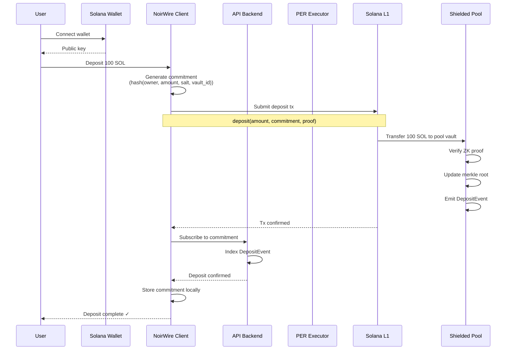
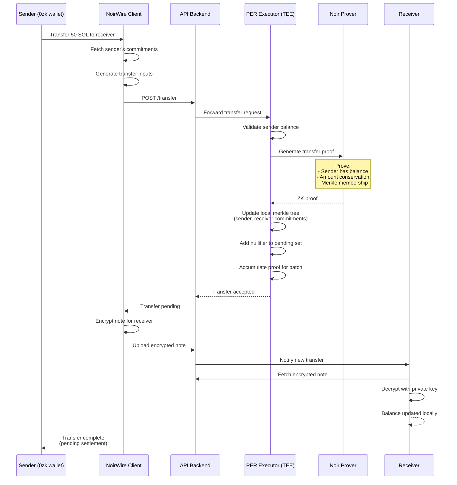
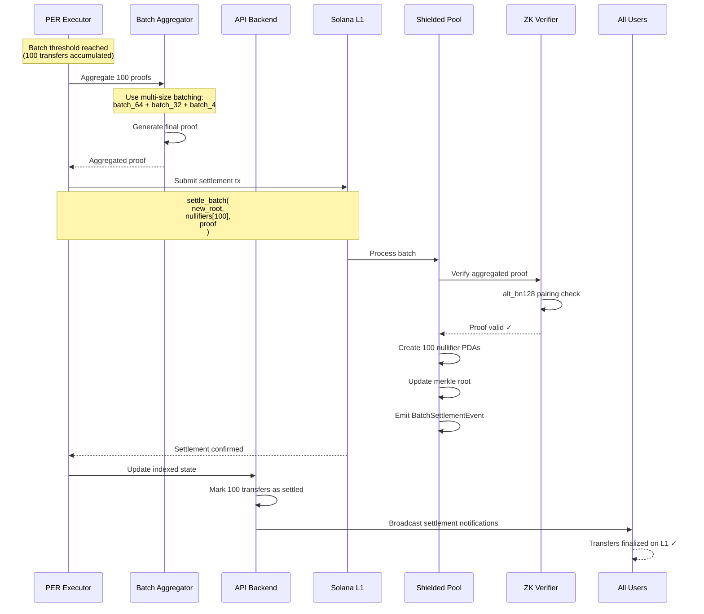
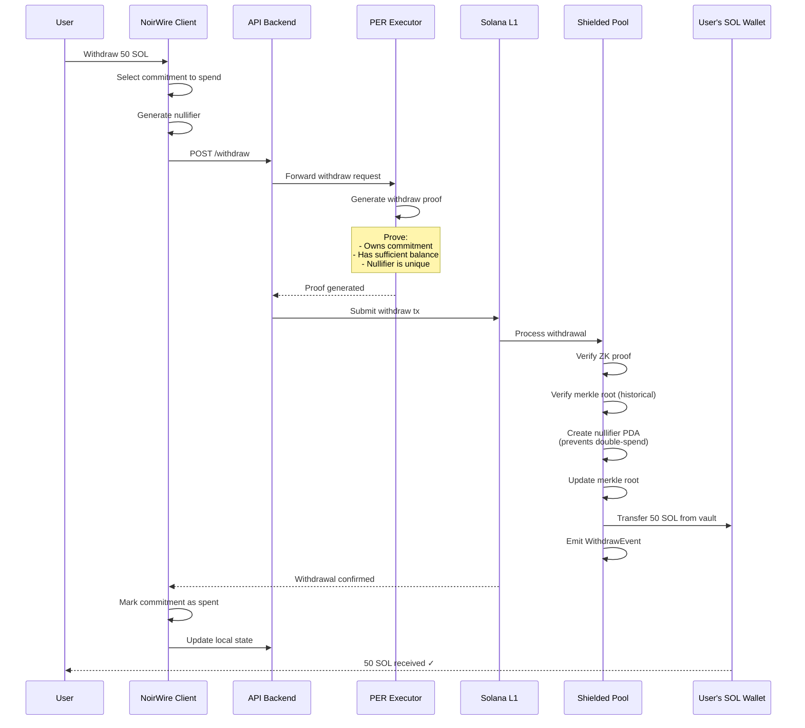
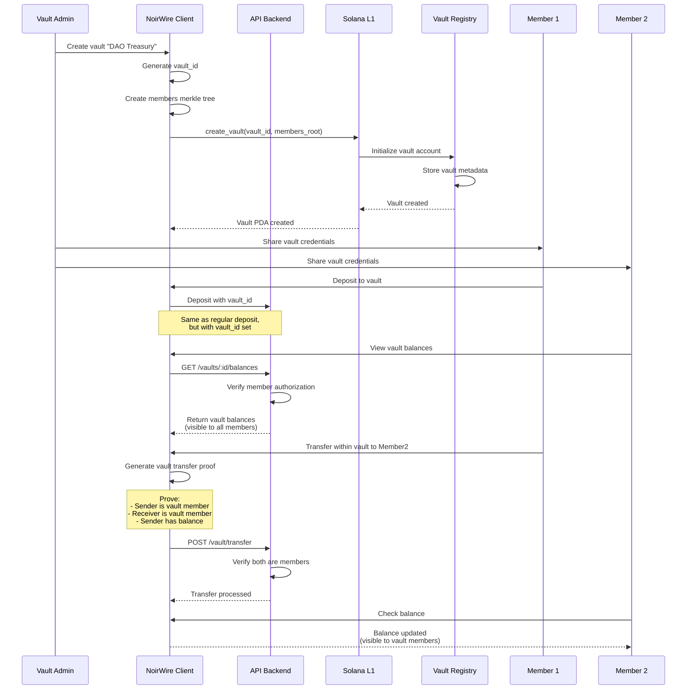

# Components — Private Transfer MVP (PER + Noir ZK)

## Can one PER block include multiple operations?

Yes. PER is an ER session, so it can process multiple transactions per block just like Solana, as long as your program logic allows those instruction types. You can mix operations (e.g., deposits, private transfers, withdrawals) within the same PER block.

## Recommendation on who runs PER/prover

For a hackathon MVP: **single operator** (your team) running the PER node and any ZK proving service. It’s simpler, cheaper, and faster to iterate. You can later move to a more distributed operator set if you need stronger decentralization.

## Required components (MVP)

### 1) On-chain programs (Solana)

- **Anchor program** for deposits/withdrawals and settlement
- **Permission Program interactions** (via CPI) to define access rules for private accounts

### 2) Private execution layer (MagicBlock)

- **PER node / TEE RPC** (MagicBlock endpoint)
- **Delegation/commit/undelegate flows** for the private accounts
- **Vault allowlist (future)**: role/group‑based list via the Permission Program for private reads/writes

### 3) Client app (Next.js)

- **Wallet auth** for signing the PER challenge
- **PER token handling** (authorization token in RPC headers/query)
- **Private transfer UI** (balances, transfers, history for authorized users)

### 4) API / backend (NestJS)

- **Light backend** for session management, metrics, and admin operations
- **Indexing pipeline** for L1 events + PER metadata + proof manifests

### 5) ZK layer (Noir)

- **Noir circuits** for batch proofs of correctness/compliance
- **Prover service** (batching and proof generation)
- **Verifier program** on Solana for proof verification
- **ZK scope**: settlement‑grade proofs (notes/nullifiers on‑chain)

### 6) Storage (Supabase)

- **Supabase Postgres** for notes, scans, caches, analytics, and proof metadata
- **Object storage** (Supabase Storage or S3) for proof artifacts and TEE attestation bundles

## Optional components (later)

- **Monitoring/alerts** for PER uptime and proof failures
- **Rate‑limit / API gateway** for production hardening

## Railgun comparison table (ordered)

| #   | Capability              | Railgun (typical)              | This stack (Solana + PER + Noir)                                                      |
| --- | ----------------------- | ------------------------------ | ------------------------------------------------------------------------------------- |
| 1   | Private state           | Shielded pool + commitments    | PER‑delegated accounts inside TEE + permissions (optionally wallet‑allowlisted vault) |
| 2   | Double‑spend protection | Nullifier set on‑chain         | Noir nullifiers if ZK is used; otherwise PER permissions + account rules in MVP       |
| 3   | Proof generation        | Client or prover service       | Noir prover service (batch proofs) separate from PER execution                        |
| 4   | Verification            | On‑chain verifier              | Solana verifier program (Anchor)                                                      |
| 5   | Wallet privacy UX       | Viewing keys + local scan      | PER auth token for reads; optional viewing keys for ZK layer                          |
| 6   | Indexing                | Mandatory for notes/nullifiers | Mandatory: L1 events + PER metadata + proofs + note scans                             |
| 7   | Relayers                | Common (fee abstraction)       | Optional; privacy still holds without relayers if PER access is permissioned          |
| 8   | Compliance controls     | Usually external               | Not required for MVP (can add later)                                                  |
| 9   | Frontend                | Web/mobile wallets             | Next.js app                                                                           |
| 10  | Backend/API             | Relayer/indexer services       | NestJS API + indexer pipeline                                                         |
| 11  | Database                | Notes + scans + caches         | Supabase Postgres + object storage (notes/scans/caches + proofs)                      |

---

## Detailed Sequence Diagrams

### 1. Deposit Flow (Shield → Private)



### 2. Private Transfer Flow (PER Execution)



### 3. Batch Settlement Flow (PER → L1)



### 4. Withdrawal Flow (Private → Unshield)



### 5. Vault Creation & Transfer Flow



### 6. End-to-End Privacy Flow

```
User A (Public)                    |  SHIELDED POOL (Private)  |  User B (Public)
                                   |                           |
1. Deposit 100 SOL ────────────────>│   Commitment A: 100      │
   (visible on L1)                 │   (nobody knows owner)   │
                                   │                           │
2. Private Transfer ───────────────>│   Nullify A              │
   50 SOL to User B                │   Commitment A': 50       │
   (happens inside PER/TEE)        │   Commitment B: 50        │
                                   │   (unlinkable transfers)  │
                                   │                           │
                                   │   User B withdraws ───────>  3. Receive 50 SOL
                                   │   (visible on L1)         │     (visible on L1)
                                   │                           │

Privacy Properties:
✓ Nobody knows User A has 100 SOL (commitment is hash)
✓ Nobody knows 50 SOL went from A → B (happens in TEE)
✓ Nobody can link User A's deposit to User B's withdrawal
✓ Only User B knows they received from someone (note decryption)
✓ Even PER operator can't see balances (encrypted in TEE)
```

---

## Future todo table

| Item                       | Status | Notes                                                                        |
| -------------------------- | ------ | ---------------------------------------------------------------------------- |
| Relayers                   | Future | Add if you want fee abstraction or sender obfuscation at the mempool level.  |
| Role/group vault allowlist | Future | Implement via Permission Program groups once policy is defined.              |
| Fully opaque settlement    | Future | Hide even batch totals; requires more careful proof design and UX tradeoffs. |
